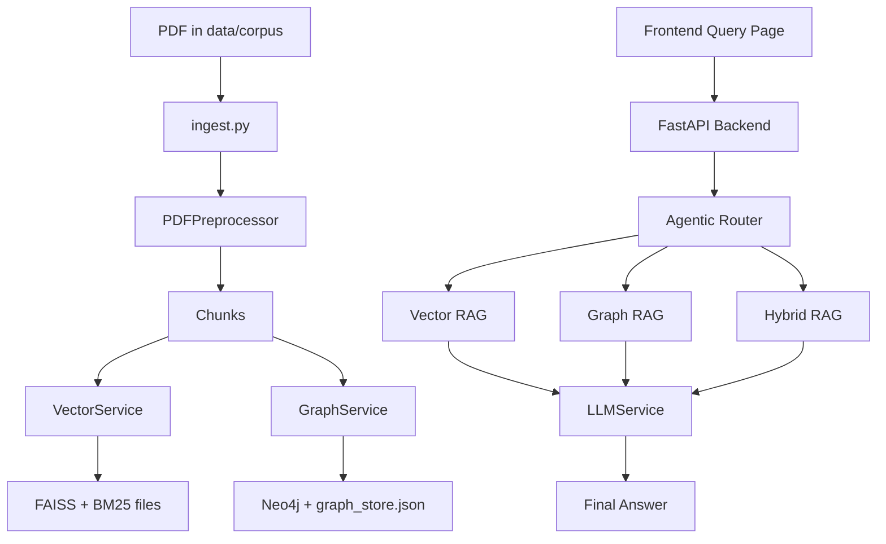

# PFA RAG Project Guide

This project is a question-answering system that reads a PDF, turns it into searchable data, and then answers questions using that data.

If you want the simplest mental model, think of it like this:

- The PDF is the book.
- The backend is the brain.
- The frontend is the dashboard.
- The data folder is the memory.
- The AI model is the writer that turns search results into a clear answer.

The project uses a common AI pattern called RAG, which means Retrieval-Augmented Generation.

In plain English, that means:

1. First, the system searches for the most relevant information.
2. Then it gives that information to an AI model.
3. The AI model writes a final answer using only the retrieved context.

This project does that in three ways:

- Vectorial RAG: searches by meaning.
- Graph RAG: searches by relationships.
- Hybrid RAG: uses both at the same time.

There is also an agentic router that learns which search style works best for each kind of question.

## What This Project Is For

The project is designed to help a user ask questions about a document, usually a PDF, and get a useful answer back.

It is especially good for questions like:

- What does this section mean?
- How are these concepts related?
- Which parts of the document mention this topic?
- Can you explain the important ideas in simple words?

The system is built around one main document pipeline:

1. Read the PDF.
2. Split it into smaller text pieces.
3. Build a vector index for semantic search.
4. Build a knowledge graph for relationship search.
5. Let the user ask questions through the frontend.
6. Send the question to the backend.
7. Retrieve the best context.
8. Ask the LLM to write the final answer.
9. Log the result and update the learning router.

## Big Picture Architecture



### Simple explanation of each part

- `ingest.py` prepares the document.
- `backend/services/preprocessor.py` extracts and cleans the text.
- `backend/services/vectorial.py` builds semantic search indexes.
- `backend/services/graph.py` builds the knowledge graph and graph search.
- `backend/services/agentic.py` decides which route to use.
- `backend/services/llm.py` turns retrieved context into a readable answer.
- `frontend/` gives the user a visual interface.
- `data/` stores the generated files used by the app.

## How The Three Search Modes Work

### 1. Vectorial RAG

This mode searches by meaning.

If the user asks something like:

- "Explain the main idea"
- "What does this concept mean?"

the system looks for chunks of text that are semantically similar to the question.

It uses:

- Sentence transformers to create embeddings.
- FAISS to find similar chunks quickly.
- BM25 to also match important keywords.

This is good when the answer is in the document but not written using the exact same words as the question.

### 2. Graph RAG

This mode searches by relationships.

If the user asks something like:

- "How are these ideas connected?"
- "What relates to this term?"
- "Show the structure of the topic"

the system uses the knowledge graph.

The graph stores things like:

- documents
- pages
- chunks
- extracted terms
- relationships between terms

This is useful when the meaning depends on connections, not just text similarity.

### 3. Hybrid RAG

This mode uses both vector search and graph search.

It is the safest choice when a question needs:

- both explanation and context
- both keyword matching and relationships
- broader evidence from the document

## The Learning Part: Agentic Routing

The project does not always choose the same search mode.

Instead, it uses a Q-learning router.

You can think of this as a simple learning system that remembers which route gave the best result for similar questions in the past.

Here is the idea:

1. The router looks at the question.
2. It classifies the question as more structural, semantic, or factual.
3. It chooses vector, graph, or hybrid search.
4. The system scores the result using an automatic reward.
5. The score updates the Q-table.
6. Future questions can benefit from that learning.

So the system becomes better over time, even without manual feedback every time.

## End-To-End Workflow

### Step 1: Put the PDF in the corpus folder

Place the PDF you want to use in `data/corpus/`.

The default code expects a PDF there. If more than one PDF exists, `ingest.py` will pick the first one unless you pass `--pdf`.

### Step 2: Run ingestion

`ingest.py` reads the PDF and prepares the data.

It does three main things:

1. Extracts text from the PDF.
2. Splits the text into chunks.
3. Builds the vector and graph stores.

### Step 3: Start the backend

The backend is a FastAPI app.

It exposes routes for:

- health checks
- questions and answers
- vector search data
- graph visualization data
- agentic learning data

### Step 4: Start the frontend

The frontend is a Next.js app.

It gives you a visual way to:

- ask questions
- inspect the vector index
- explore the graph
- see how the router is learning

### Step 5: Ask a question

The frontend sends your question to the backend.

The backend:

1. decides which route to use,
2. retrieves the best evidence,
3. sends the evidence to the LLM,
4. returns the answer,
5. logs the result,
6. updates the router.

## Project Structure

### Root level

- `ingest.py` - main ingestion script that builds the vector and graph data.
- `Dockerfile` - builds the backend container.
- `docker-compose.yml` - runs the backend together with Neo4j.
- `requirements.txt` - Python dependencies.
- `README.md` - this guide.
- `docs/` - design notes and pipeline explanation.
- `scratch/` - temporary debugging or inspection scripts.
- `rel_check.txt` - scratch note file used during relationship checking.

The root is intentionally kept focused on the main workflow plus deployment files.

### Backend folder

#### `backend/main.py`

This is the backend entry point.

It creates the FastAPI app, enables CORS, registers the routers, and starts the server when run directly.

#### `backend/config.py`

This file holds project settings.

It reads values from the environment and `.env` file.

Important settings include:

- app name and version
- Neo4j connection values
- embedding model name
- FAISS file path
- graph store path
- LLM provider and API keys

#### `backend/models/schemas.py`

This file defines the request and response shapes used by the API.

It tells the backend what a query request and query response should look like.

#### `backend/routers/`

These files define the HTTP endpoints.

- `health.py` - simple health check.
- `query.py` - main question answering route.
- `vectorial.py` - vector index stats, PCA, samples, evaluation metrics.
- `graph.py` - graph visualization, communities, metrics.
- `agentic.py` - router policy, reward history, reset, route diagnostics.

#### `backend/services/`

These files contain the actual logic.

- `preprocessor.py` - reads PDF text, cleans it, and splits it into chunks.
- `vectorial.py` - creates embeddings, builds FAISS and BM25, performs semantic retrieval.
- `graph.py` - builds the Neo4j graph, extracts terms, finds relationships, runs graph search, and computes communities.
- `agentic.py` - Q-learning router that chooses the best retrieval strategy.
- `llm.py` - sends the retrieved context to Gemini or Groq and returns the final answer.
- `auto_reward.py` - scores the retrieval result and logs query history.

### Frontend folder

The frontend is a Next.js app.

#### `frontend/pages/_app.js`

Loads the global CSS for every page.

#### `frontend/pages/index.js`

Home page with the main navigation.

#### `frontend/pages/query.js`

This is the main user page.

It lets the user type a question, sends it to the backend, and shows:

- the final answer
- confidence
- reward information
- retrieved sources
- graph subgraph information
- recent query history

#### `frontend/pages/vectorial.js`

Shows vector search information.

It displays:

- whether the index is loaded
- chunking parameters
- sample chunks
- PCA visualization of embeddings
- retrieval evaluation metrics

#### `frontend/pages/graph.js`

Shows the knowledge graph.

It lets the user:

- inspect the full graph
- filter relationship types
- adjust edge weight thresholds
- open communities
- inspect graph metrics

#### `frontend/pages/agentic.js`

Shows the learning system.

It displays:

- the current Q-learning policy
- reward trend over time
- the latest answer result
- the decision path taken by the router

#### `frontend/components/NavBar.js`

Top navigation bar for the four main pages.

#### `frontend/components/ForceGraph.js`

Small wrapper around the graph visualization library so it works well with Next.js.

#### `frontend/lib/api.js`

Axios client used by the frontend to talk to the backend.

It reads `NEXT_PUBLIC_API_URL`, and defaults to `http://localhost:8000`.

#### `frontend/styles/globals.css`

Global styling for the entire frontend.

This file controls the main theme, layout, cards, buttons, scrollbars, and dashboard look.

#### `frontend/package.json`

Contains the frontend scripts and dependencies.

Main scripts:

- `npm run dev`
- `npm run build`
- `npm start`

### Data folder

The `data/` folder stores generated outputs.

These files are usually created or updated by ingestion and query runs.

- `faiss_index.index` - the vector index.
- `faiss_index_chunks.json` - chunk text and metadata.
- `faiss_index_embeddings.npy` - raw embeddings used for analysis and PCA.
- `faiss_index_bm25.pkl` - BM25 keyword index.
- `graph_store.json` - local graph export.
- `graph_store_semantic.json` - semantic graph export.
- `knowledge_base_clean.json` - cleaned knowledge base data.
- `q_table.pkl` - the learned Q-learning table.
- `query_logs.jsonl` - query history and reward logs.
- `cleaned_corpus/` - cleaned page-level PDF extraction output.
- `corpus/` - source PDF files to ingest.
- `eval/` - evaluation inputs and reports.

Important note: these are generated data files, not hand-written source code.

## API Overview

### Health

- `GET /health` - checks whether the backend is alive.

### Query

- `POST /query/` - main question answering endpoint.
- `GET /query/history` - recent query history.

### Vectorial

- `GET /vectorial/stats` - vector index status and sample chunks.
- `GET /vectorial/pca` - 2D embedding points as JSON.
- `GET /vectorial/pca_image` - PCA image.
- `GET /vectorial/search?query=...` - semantic search.
- `GET /vectorial/eval-metrics` - retrieval evaluation results.

### Graph

- `GET /graph/visualization` - full graph data.
- `GET /graph/communities` - Louvain community information.
- `GET /graph/communities/{community_id}` - one community as a subgraph.
- `GET /graph/metrics` - graph metrics.

### Agentic

- `GET /agentic/route?query=...` - suggests a route for a question.
- `GET /agentic/policy` - Q-table view for the frontend.
- `GET /agentic/stats` - route performance stats.
- `GET /agentic/reward-history` - reward trend over time.
- `POST /agentic/feedback` - manual training with explicit feedback.
- `POST /agentic/reset` - clears the learned policy and logs.

## How To Run It

The project can be run in two common ways:

1. With Docker Compose.
2. With local Python and Node.js.

### Option 1: Docker Compose

This is the simplest way if you want the backend and Neo4j to run together.

1. Create a `.env` file in the project root.
2. Put your Neo4j and LLM credentials in it.
3. Run `docker-compose up`.
4. In another terminal, start the frontend with `npm run dev` inside `frontend/`.

The Docker setup starts:

- the FastAPI backend
- a Neo4j container

### Option 2: Local Development

#### Backend on Windows PowerShell

```powershell
cd E:\pfa_RAG
python -m venv venv
.\venv\Scripts\Activate.ps1
pip install -r requirements.txt
python ingest.py --pdf data\corpus\16.pdf --save-cleaned --export-graph-json
python -m uvicorn backend.main:app --reload --host 0.0.0.0 --port 8000
```

#### Frontend

```powershell
cd E:\pfa_RAG\frontend
npm install
npm run dev
```

### Where To Open The App

- Frontend: `http://localhost:3000`
- Backend docs: `http://localhost:8000/docs`
- Backend health check: `http://localhost:8000/health`

## How To Prepare The Data

The system expects a PDF in `data/corpus/`.

If you want to rebuild everything from scratch:

1. Put the PDF in `data/corpus/`.
2. Run `ingest.py`.
3. Wait for the vector index and graph data to finish building.
4. Start the backend and frontend.

Common ingestion flags:

- `--pdf` to choose a specific PDF.
- `--chunk-size` to change chunk size.
- `--chunk-overlap` to change overlap between chunks.
- `--save-cleaned` to save cleaned page text.
- `--cleaned-output` to set a custom output file.
- `--export-graph-json` to save a local graph export.

## Configuration And Environment Variables

The backend reads settings from `.env`.

Important variables:

- `NEO4J_URI` - Neo4j connection URI.
- `NEO4J_USER` - Neo4j username.
- `NEO4J_PASSWORD` - Neo4j password.
- `EMBEDDING_MODEL` - sentence embedding model.
- `FAISS_INDEX_PATH` - base path for FAISS files.
- `HYBRID_VECTOR_WEIGHT` - balance between vector and keyword search.
- `GRAPH_STORE_PATH` - path for local graph export.
- `GRAPH_NER_MODEL` - model used for entity extraction.
- `LLM_PROVIDER` - `groq` or `gemini`.
- `GEMINI_API_KEY` - Gemini API key.
- `GROQ_API_KEY` - Groq API key.
- `GEMINI_MODEL` - Gemini model name.
- `GROQ_MODEL` - Groq model name.
- `CORPUS_DIR` - folder that holds source PDFs.

## What Each Dependency Is Doing

This project uses a lot of packages because it combines PDF processing, search, graph work, and UI.

The most important ones are:

- FastAPI and Uvicorn for the backend server.
- Pydantic for request and response models.
- Sentence Transformers for embeddings.
- FAISS for fast vector search.
- Rank-BM25 for keyword search.
- Neo4j for the knowledge graph.
- PyMuPDF for PDF text extraction.
- LangChain text splitters for chunking.
- YAKE for keyword extraction.
- Transformers for named entity recognition.
- scikit-learn for PCA.
- pandas and matplotlib for analysis and charts.
- React, Next.js, SWR, Recharts, and react-force-graph for the frontend.

## Notes For Someone Writing A Report

If your groupmate needs to explain the project in a report, the easiest summary is this:

This project is a document question-answering system. It reads a PDF, turns it into two types of searchable memory, and lets a user ask questions through a web interface. One memory is based on meaning similarity, and the other is based on relationships between concepts. A small learning system chooses which memory to use. The retrieved information is then passed to a large language model, which writes the final answer in natural language.

## Important Limitations

This project is powerful, but it is not magic. A few practical limitations matter:

- It depends on external API keys for the final answer generation.
- It depends on Neo4j for the graph features.
- It works best with text-based PDFs, not scanned images.
- The graph and vector data are generated files, so they need to be rebuilt if the source PDF changes.
- The learning system is simple Q-learning, not a full autonomous agent.

## Suggested First Things To Read In The Code

If you want to learn the code in a good order, read these files first:

1. `backend/main.py`
2. `backend/routers/query.py`
3. `backend/services/agentic.py`
4. `backend/services/vectorial.py`
5. `backend/services/graph.py`
6. `backend/services/llm.py`
7. `backend/services/preprocessor.py`
8. `frontend/pages/query.js`
9. `frontend/pages/vectorial.js`
10. `frontend/pages/graph.js`
11. `frontend/pages/agentic.js`

## Short Version

If you only remember one thing, remember this:

The system takes a PDF, builds a searchable vector index and a knowledge graph, then uses a learning router to decide how to search and a language model to write the answer.
