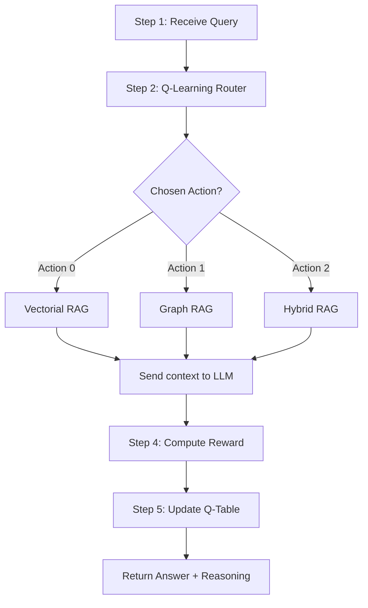

# Agentic RAG Pipeline — Implementation Summary

## Pipeline Flow (as implemented)

## Files Modified

| File | Change |
|------|--------|
| [graph.py](file:///e:/pfa_RAG/backend/services/graph.py) | Added `graph_search()` — query-driven Neo4j retrieval |
| [agentic.py](file:///e:/pfa_RAG/backend/services/agentic.py) | Improved feature extraction (structural vs semantic vs factual) |
| [query.py](file:///e:/pfa_RAG/backend/routers/query.py) | Rewrote all 3 routes to use proper retrieval → LLM |
| [llm.py](file:///e:/pfa_RAG/backend/services/llm.py) | Route-aware prompts for better answers |
| [agentic.py router](file:///e:/pfa_RAG/backend/routers/agentic.py) | Fixed missing `json` import |

## Key Changes Explained

### 1. `graph_search()` — New Graph RAG Retrieval
Previously the graph route called `get_visualization_data()` which dumped the **entire** graph (all nodes/links) as context — useless for answering a specific question.

Now it does real query-driven retrieval:
- **Step 1**: Extract search terms from the query (FR+EN stop words removed)
- **Step 2**: `MATCH (t:Term) WHERE ... CONTAINS term` — find matching Term nodes
- **Step 3**: `MATCH (a:Term)-[r]->(b:Term)` — get relationships between matched terms
- **Step 4**: `MATCH (c:Chunk)-[:MENTIONS]->(t:Term)` — retrieve actual text chunks connected to those terms
- **Fallback**: If no terms match, searches chunk text directly

All Cypher queries are logged and returned in `thought_process` for transparency.

### 2. Improved Q-Learning Feature Extraction
The state classifier now detects 3 query types instead of 2:
- **structural** → keywords like "relation", "comparer", "liste", "overview" → favors Graph RAG
- **semantic** → keywords like "expliquer", "définir", "describe" → favors Vectorial RAG  
- **factual** → no strong signal → Q-learning decides based on past rewards

### 3. All Routes → LLM
Every route now:
1. Retrieves relevant context (vector chunks, graph chunks, or both)
2. Sends that context to Gemini with a **route-aware prompt**
3. Returns the LLM-generated human-like answer as the primary response

### 4. Route-Aware LLM Prompts
- **Graph**: "You are a research assistant with access to a knowledge graph..."
- **Hybrid**: "...using both vector search and knowledge graph retrieval..."
- **Vector**: "Answer based ONLY on the provided context..."

### 5. Graph Route Response Includes
When Graph RAG is selected, `thought_process` now contains:
- `cypher_queries`: List of all Neo4j queries executed with descriptions
- `subgraph`: The explored nodes and links
- `matched_terms`: Terms found in the knowledge graph
- `relationships`: Relationships discovered between terms
